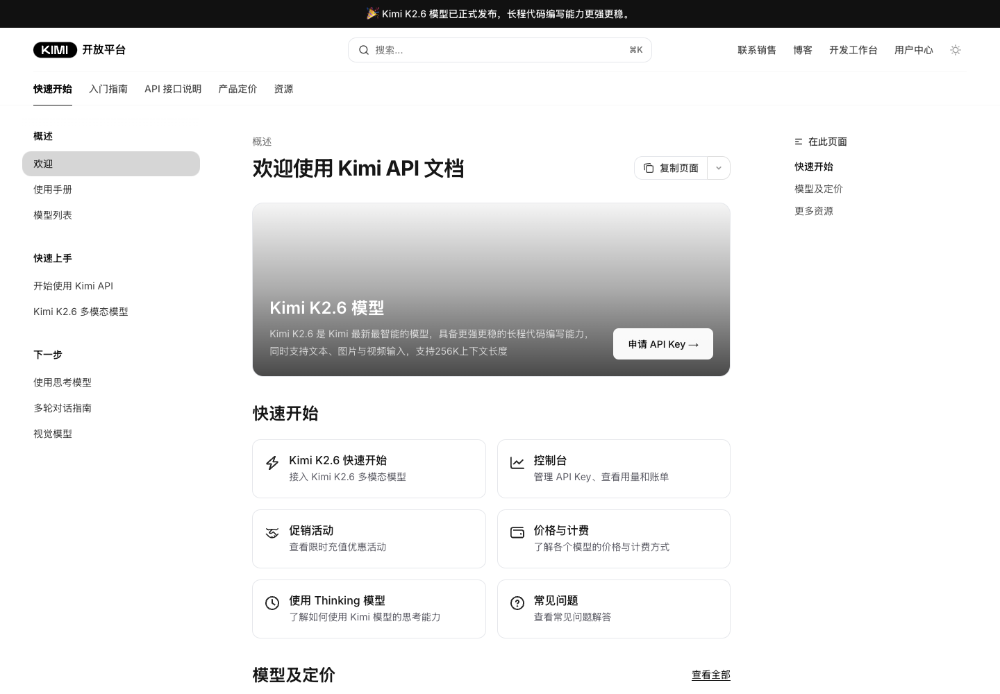
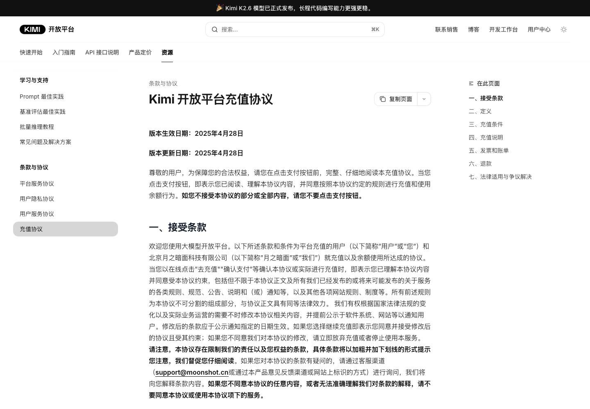
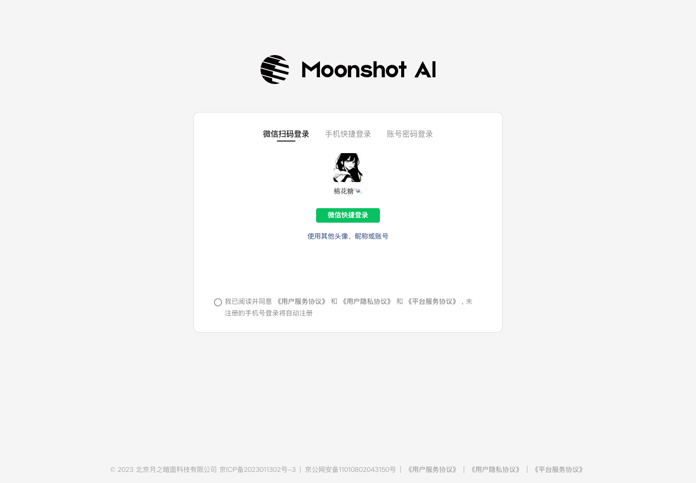
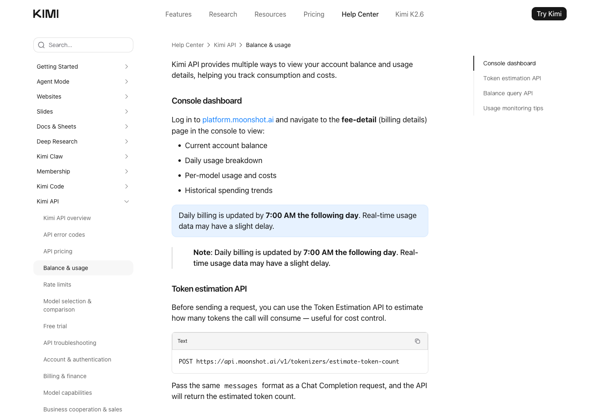
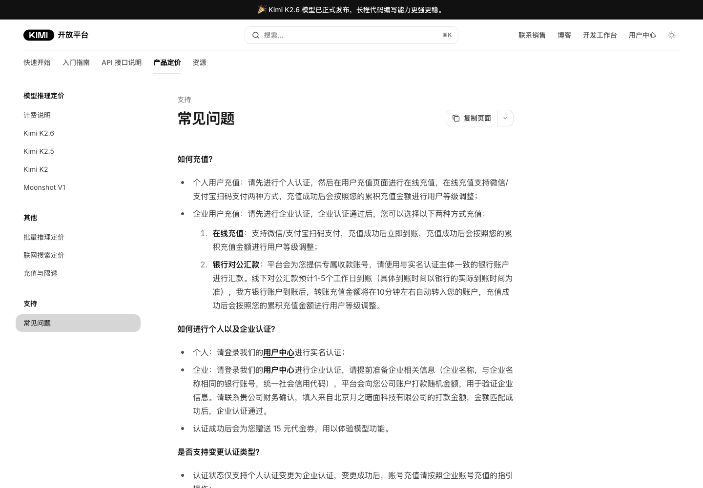
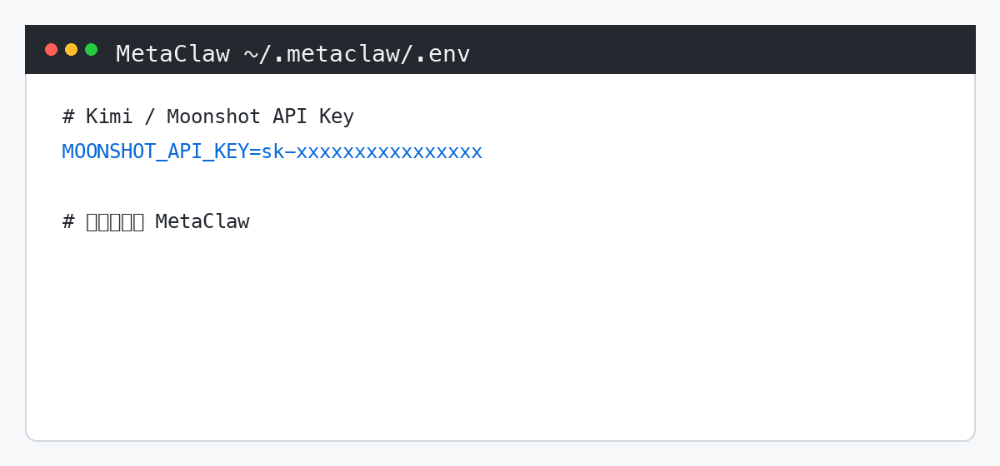
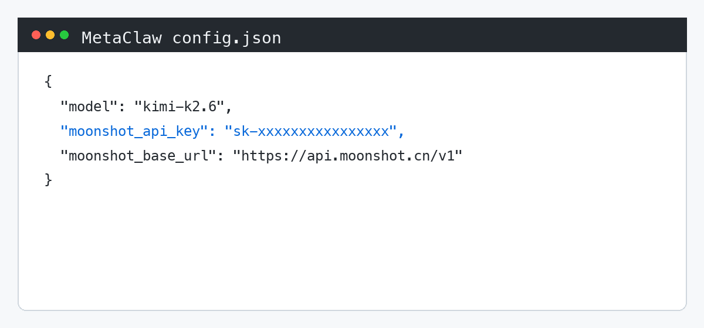

# Kimi API 充值、Key 获取与 MetaClaw 配置新人教程

> 适用对象：第一次使用国内版 Kimi API 的同事。
> 适用范围：开户注册、充值、创建 API Key、查看余额、查看消耗、申请发票，以及在 MetaClaw 中配置 Kimi API Key。
> 平台版本：国内版 Kimi API 开放平台。

## 0. 开始前请先确认

- 你要使用的是 Kimi API 开放平台，不是 Kimi 网页版会员。
- Kimi 网页版会员权益和 API 账户余额不是同一套余额体系。
- API Key 是敏感信息，只能自己保存，不能发群、不能截图展示完整内容、不能提交到代码仓库。
- 本教程中的截图需要隐藏手机号、邮箱、企业信息、余额金额、完整 API Key。

参考入口：

- Kimi API 文档：<https://platform.kimi.com/docs>
- Kimi API 控制台：<https://platform.moonshot.cn/console>
- API Key 管理：<https://platform.moonshot.cn/console/api-keys>
- API Base：`https://api.moonshot.cn/v1`

【截图 0：Kimi API 文档或控制台首页】
截图要求：展示页面入口即可，不要露出个人账号信息。



## 1. 注册、登录与实名认证

1. 打开 Kimi API 控制台：<https://platform.moonshot.cn/console>。
2. 使用手机号、微信或企业指定方式登录。
3. 首次使用时，按页面提示完成个人认证或企业认证。
4. 如果公司需要统一开票、对公付款或多人管理，优先使用企业认证账号。

【截图 1：控制台登录后首页】
截图要求：打码手机号、邮箱、用户名、企业名。


【截图 2：实名认证入口】
截图要求：只展示入口位置，不展示证件号、真实姓名、企业证照等信息。

完成后自检：

- 能正常进入控制台。
- 账号认证状态显示为已完成，或页面没有继续拦截充值/API Key 创建。
- 已确认该账号是后续要用于公司项目的账号。

## 2. 充值

1. 在控制台找到「充值」「费用中心」「账单」或类似入口。
2. 进入充值页面后，选择充值金额。
3. 个人充值通常可使用微信或支付宝扫码支付。
4. 企业充值可按页面支持方式选择在线充值或对公汇款。
5. 支付完成后返回控制台，确认余额已增加。

【截图 3：充值入口】
截图要求：展示从控制台进入充值页面的位置，隐藏账号信息。



【截图 4：充值支付页面】
截图要求：二维码、订单号、付款人信息、余额金额需要打码；只保留步骤示意。

注意事项：

- API 调用按量计费，余额不足时会导致调用失败。
- 如果使用对公汇款，到账时间可能不是实时的，以控制台显示为准。
- 给新人演示时建议使用小额充值或测试账号。

## 3. 创建并保存 API Key

1. 打开 API Key 管理页：<https://platform.moonshot.cn/console/api-keys>。
2. 点击「创建 API Key」或页面中的同类按钮。
3. 按页面提示填写名称，例如：`metaclaw-prod`、`metaclaw-test`。
4. 创建后立即复制 API Key，并保存到公司指定的密钥管理位置。
5. 关闭弹窗前确认已经保存，因为部分平台只展示一次完整 Key。

【截图 5：API Key 管理页面】
截图要求：Key 列表里的 Key 片段、创建人、备注信息全部打码。



【截图 6：创建 API Key 弹窗】
截图要求：完整 Key 必须打码，只能保留类似 `sk-****abcd` 的示意。

推荐命名：

| 场景 | Key 名称示例 | 说明 |
| --- | --- | --- |
| 本地测试 | `metaclaw-dev-姓名` | 方便定位是谁在测试 |
| 测试环境 | `metaclaw-test` | 给测试服务使用 |
| 生产环境 | `metaclaw-prod` | 只给正式服务使用 |

安全要求：

- 不要把 API Key 写进截图、聊天记录、飞书群消息或公开文档。
- 不要把 API Key 提交到 Git 仓库。
- 如果 Key 泄露，立即在控制台删除旧 Key，并重新创建新 Key。

## 4. 查看余额和消耗

1. 在控制台进入「费用中心」「账单」「费用明细」或类似页面。
2. 查看当前 API 账户余额。
3. 进入消耗明细，查看按日期、模型或项目维度的消耗。
4. 如需给财务或项目负责人同步成本，优先导出账单或截取消耗趋势图。

【截图 7：余额页面】
截图要求：余额金额可按公司要求打码；如果用于内部教学，可保留示意金额但不要展示真实账号信息。



【截图 8：消耗明细页面】
截图要求：隐藏账号、项目、订单号等敏感信息；保留日期、模型、消耗趋势等字段位置。



注意事项：

- 官方帮助说明中，余额与消耗数据可能存在更新延迟。
- 日消耗、模型消耗和趋势图适合用来排查成本异常。
- 如果 MetaClaw 报余额不足或鉴权失败，先检查 Key 是否正确，再检查余额是否充足。

## 5. 申请发票

1. 在控制台进入「发票管理」或「费用中心」里的发票入口。
2. 根据页面规则选择可开票金额。
3. 填写发票抬头、税号、邮箱、地址电话等信息。
4. 提交申请后，等待平台审核和开具。
5. 下载或转发财务需要的电子发票。

【截图 9：发票管理入口】
截图要求：隐藏企业名称、税号、地址电话、邮箱。

【截图 10：申请发票页面】
截图要求：隐藏抬头、税号、收件信息、金额和订单号。

注意事项：

- 个人认证账号通常只能按个人身份申请发票。
- 企业认证账号更适合公司报销、对公开票和财务归档。
- 发票规则可能随平台政策变化，以控制台页面和官方协议为准。

## 6. 在 MetaClaw 中配置 Kimi API Key

MetaClaw 已内置 Moonshot/Kimi 支持。推荐使用环境变量配置 API Key，这样不会把密钥写进代码仓库。

### 方式一：环境变量配置，推荐

在运行 MetaClaw 的机器上配置：

```bash
MOONSHOT_API_KEY=你的KimiAPIKey
```

如果使用 `~/.metaclaw/.env` 管理环境变量，可以写成：

```bash
MOONSHOT_API_KEY=sk-xxxxxxxxxxxxxxxx
```

保存后重启 MetaClaw。

### 方式二：`config.json` 配置

如果当前部署方式使用 `config.json`，可以配置：

```json
{
  "model": "kimi-k2.6",
  "moonshot_api_key": "sk-xxxxxxxxxxxxxxxx",
  "moonshot_base_url": "https://api.moonshot.cn/v1"
}
```

说明：

- `model` 推荐先使用 `kimi-k2.6`。
- `moonshot_api_key` 填写从 Kimi 控制台创建的 API Key。
- `moonshot_base_url` 使用国内版 API Base：`https://api.moonshot.cn/v1`。
- 如果同时设置了环境变量和 `config.json`，MetaClaw 会优先使用环境变量里的 `MOONSHOT_API_KEY`。

### 方式三：OpenAI 兼容方式，可选

如果你的部署统一走 OpenAI 兼容配置，可以使用：

```json
{
  "bot_type": "openai",
  "model": "kimi-k2.6",
  "open_ai_api_base": "https://api.moonshot.cn/v1",
  "open_ai_api_key": "sk-xxxxxxxxxxxxxxxx"
}
```

一般情况下，优先使用方式一或方式二；只有项目已有 OpenAI 兼容网关配置习惯时，再使用方式三。

【截图 11：MetaClaw 环境变量或部署配置页面】
截图要求：完整 Key 必须打码，只展示变量名 `MOONSHOT_API_KEY`。



【截图 12：MetaClaw 配置文件示例】
截图要求：Key 用 `sk-****` 或 `sk-xxxxxxxxxxxxxxxx` 示例，不展示真实密钥。



## 7. 重启并验证

1. 保存配置后重启 MetaClaw。
2. 在 MetaClaw 对话入口发送一条简单测试消息，例如：`你好，请用一句话介绍你自己。`
3. 如果能正常回复，说明 Key、模型和余额基本可用。
4. 如果失败，按下面的清单排查。

【截图 13：MetaClaw 测试成功页面】
截图要求：只展示测试消息和回复，不展示后台密钥。

常见问题：

| 问题 | 可能原因 | 处理方式 |
| --- | --- | --- |
| 鉴权失败 | API Key 填错、复制时多了空格、Key 已删除 | 重新复制 Key，确认没有空格，必要时重建 Key |
| 余额不足 | API 账户未充值或余额已用完 | 回到控制台充值或联系账号管理员 |
| 模型不存在 | `model` 写错，或当前账号无权限 | 先使用 `kimi-k2.6` 验证 |
| 配置未生效 | 修改后没有重启，或改错运行环境 | 重启 MetaClaw，确认配置写在实际运行机器上 |
| 国内版/国际版混用 | API Base 和 Key 所属平台不一致 | 国内版使用 `https://api.moonshot.cn/v1` |

安全检查清单：

- API Key 没有出现在截图里。
- API Key 没有写进 Git 仓库。
- 生产 Key 和测试 Key 分开。
- 离职、外包结束或项目结束后，及时删除不再使用的 Key。
- 发现异常消耗时，先停用可疑 Key，再排查调用来源。

## 8. 给维护者的截图替换清单

把下面占位截图逐一替换为真实截图后，这份文档即可发布到飞书云文档：

- 【截图 0】Kimi API 文档或控制台首页
- 【截图 1】控制台登录后首页
- 【截图 2】实名认证入口
- 【截图 3】充值入口
- 【截图 4】充值支付页面
- 【截图 5】API Key 管理页面
- 【截图 6】创建 API Key 弹窗
- 【截图 7】余额页面
- 【截图 8】消耗明细页面
- 【截图 9】发票管理入口
- 【截图 10】申请发票页面
- 【截图 11】MetaClaw 环境变量或部署配置页面
- 【截图 12】MetaClaw 配置文件示例
- 【截图 13】MetaClaw 测试成功页面

发布前检查：

- 所有截图已打码。
- 所有链接能打开。
- `MOONSHOT_API_KEY`、`moonshot_api_key`、`moonshot_base_url` 拼写正确。
- 文档中没有真实完整 API Key。

## 9. 官方参考资料

- Kimi API 文档首页：<https://platform.kimi.com/docs>
- Kimi API 主要概念：<https://platform.kimi.com/docs/introduction>
- Kimi API 充值协议：<https://platform.kimi.com/docs/agreement/payment>
- Kimi API 价格常见问题：<https://platform.kimi.com/docs/pricing/faq>
- Kimi API 余额与消耗说明：<https://www.kimi.com/help/kimi-api/api-balance-and-usage>
- MetaClaw Kimi 模型配置：`metaclaw/metaclaw/docs/models/kimi.mdx`
